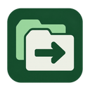

# Tab Switcher



Find open and recently closed tabs across all Chrome windows. Click an open tab to switch to it, or a closed tab to reopen it.

- Tabs ordered by last access, newest first.
- Fuzzy, exact-text, and regex search across titles and URLs.
- Highlighted matches and keyboard navigation.
- Saved search preferences, a configurable history limit, and shortcut settings.

## Install

Requires **Node.js 22.12+**, npm, and **Chrome 121+**.

From the project directory:

```sh
npm ci
npm run build
```

1. Open `chrome://extensions` in Chrome.
2. Enable **Developer mode**.
3. Select **Load unpacked** and choose the project's `.output/chrome-mv3` folder.
4. Pin **Tab Switcher** from the extensions menu, then click its icon to open it.

After source changes, run `npm run build` again and click **Reload** on `chrome://extensions`.
